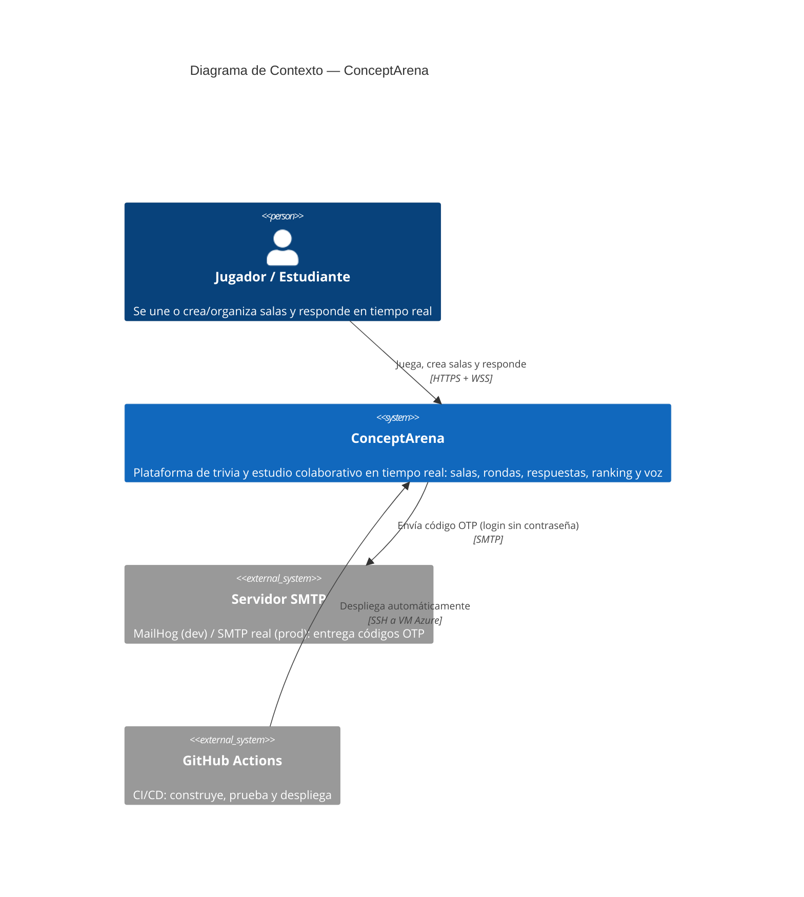
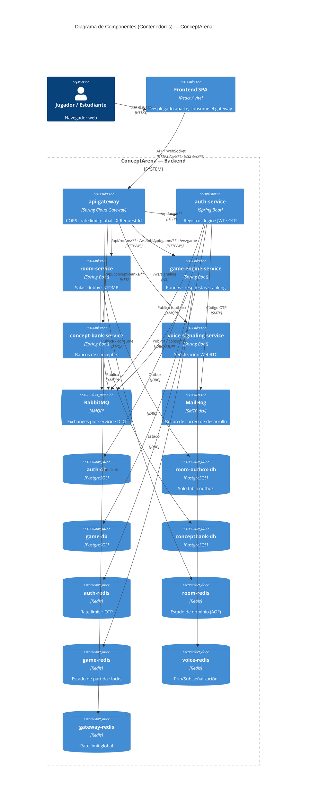
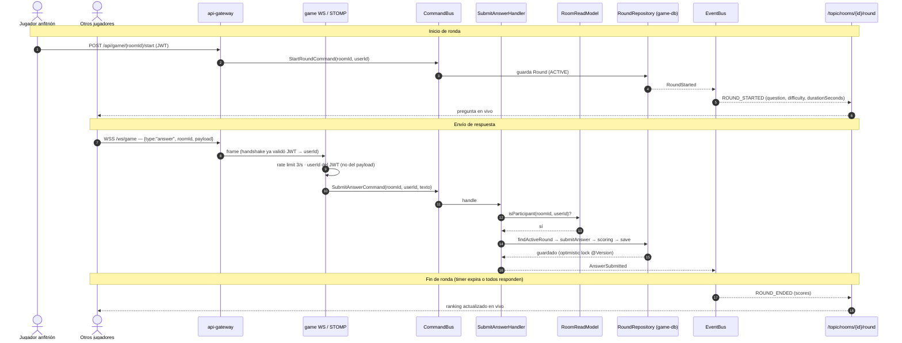
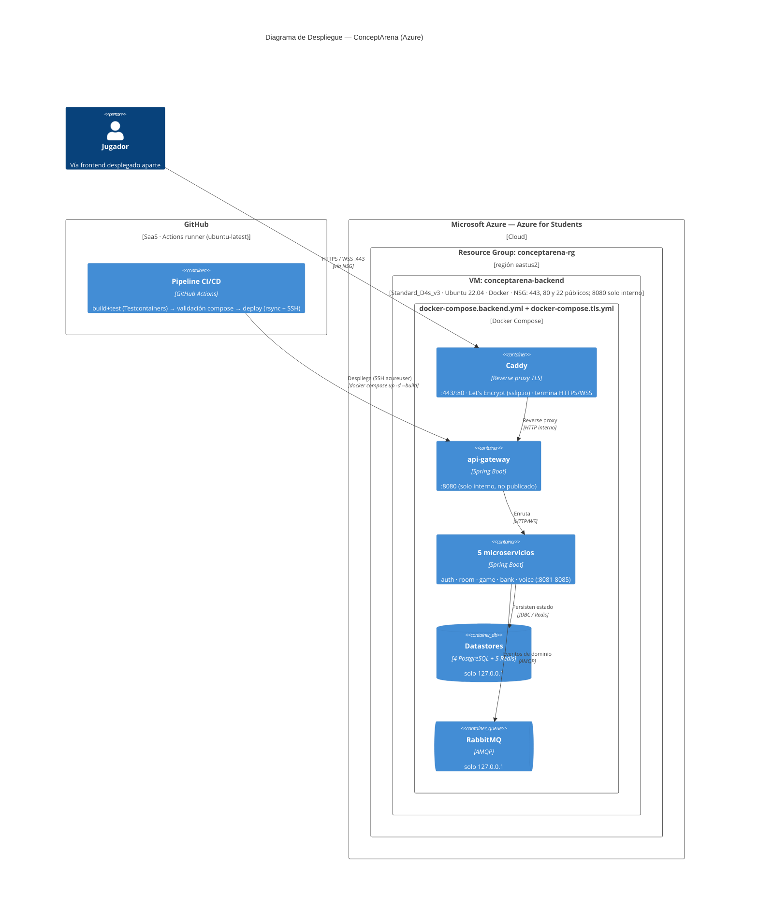
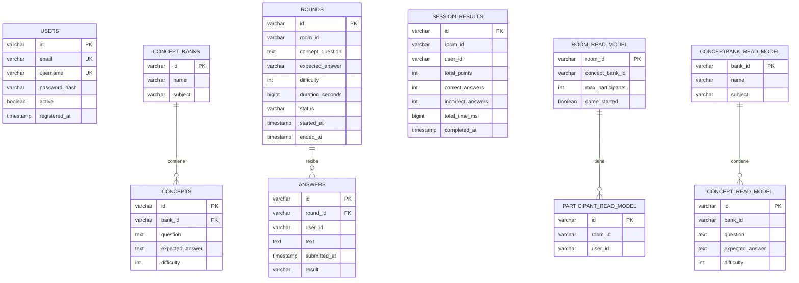

# ConceptArena — Documento de Arquitectura

Plataforma web **multijugador de estudio colaborativo / trivia en tiempo real** (salas, rondas,
respuestas, ranking y voz), construida con **microservicios event-driven** en Spring Boot y
desplegada en Azure.

Este documento consolida todo: visión general, actores, microservicios, patrones de arquitectura,
flujos de comunicación, los 3 pilares (observabilidad · escalabilidad · resiliencia/seguridad), los
5 diagramas (notación **C4** y **UML**), el modelo de datos, el despliegue y las pruebas. Los
diagramas están en Mermaid y se renderizan directamente en GitHub, VS Code o <https://mermaid.live>.

---

## 1. Visión general

- **Backend:** un **api-gateway** + **5 microservicios de dominio** Spring Boot, cada uno dueño
  exclusivo de sus almacenes (base de datos y/o Redis por servicio).
- **Comunicación asíncrona** entre servicios por **RabbitMQ** (patrón Outbox, exchanges por servicio
  y colas de mensajes muertos / DLQ).
- **Tiempo real** con WebSocket + STOMP para el juego y la señalización de voz (WebRTC).
- **Frontend** React/Vite desplegado por separado; consume el gateway por HTTP/WS.
- **Infraestructura** en una VM de Azure orquestada con Docker Compose; **CI/CD** con GitHub Actions.
- **14 ADRs** versionados documentan cada decisión de diseño (`docs/architecture-decisions/`).

---

## 2. Actores

| Actor | Tipo | Rol |
|---|---|---|
| **Jugador / Estudiante** | Persona (único usuario del sistema) | Se une o **crea/organiza salas** y responde en tiempo real. Organizar una sala es un rol del propio jugador, **no un actor aparte**. |
| Servidor SMTP | Sistema externo | Entrega los códigos OTP (login sin contraseña). |
| GitHub Actions | Sistema externo | CI/CD: construye, prueba y **despliega** el sistema. |

> **El desarrollador NO es un actor del sistema.** El despliegue lo ejecuta **GitHub Actions**
> (sistema externo) de forma automática al hacer push a `main`; ninguna persona interactúa con el
> sistema en tiempo de ejecución para desplegarlo. Por eso no aparece como actor en ningún diagrama.

### Diagrama de Contexto (C4 Nivel 1)



---

## 3. Microservicios

| Servicio | Tecnología | Responsabilidad | Almacenes |
|---|---|---|---|
| **api-gateway** | Spring Cloud Gateway (reactivo) | Punto de entrada único: CORS, rate limit global, `X-Request-Id` | gateway-redis |
| **auth-service** | Spring Boot | Registro, login, JWT (HS256), OTP sin contraseña | auth-db (PostgreSQL), auth-redis |
| **room-service** | Spring Boot | Salas, lobby, STOMP; estado de dominio en Redis | room-redis (AOF), room-outbox-db (solo outbox) |
| **game-engine-service** | Spring Boot | Rondas, respuestas, ranking, anti-trampa (**núcleo del juego**) | game-db (PostgreSQL), game-redis |
| **concept-bank-service** | Spring Boot | Bancos de conceptos (preguntas / respuestas esperadas) | conceptbank-db (PostgreSQL) |
| **voice-signaling-service** | Spring Boot | Señalización WebRTC (relay, sin modelo de dominio — ADR-010) | voice-redis (Pub/Sub) |

Infraestructura compartida: **RabbitMQ** (mensajería), **MailHog** (SMTP de desarrollo).

### Diagrama de Componentes (C4 Nivel 2 — Contenedores)



---

## 4. Patrones de arquitectura

| Patrón | Aplicación en ConceptArena | Porqué |
|---|---|---|
| **Microservicios + database-per-service** | Cada servicio tiene su propia BD/Redis; nadie accede a la BD de otro. | Aislamiento, despliegue y escalado independientes. |
| **Event-Driven Architecture (EDA)** | Eventos de dominio por RabbitMQ (`RoundStarted`, `AnswerSubmitted`, `RoomCreated`, `ConceptBankCreated`...). | Desacople temporal entre servicios. |
| **Patrón Outbox (polling programado)** | Estado + evento se escriben en la misma transacción; un publicador drena `outbox_event` hacia RabbitMQ (ADR-002). | Entrega de eventos garantizada aunque el broker falle. |
| **CQRS ligero (read-models)** | game-engine proyecta `Room` y `ConceptBank` en tablas locales consumiendo eventos (ADR-004). | Evita llamadas síncronas en el camino caliente del juego. |
| **DDD por capas** | `domain` / `app` / `infra` / `web`; la validación de negocio vive en el dominio (ADR-012). | Reglas testeables y aisladas del framework. |
| **Autenticación stateless (JWT)** | JWT HS256 con secreto compartido (ADR-005) vía librería `jwt-validation-lib` (ADR-007); handshake JWT en WebSocket (ADR-011). | Sin sesión en servidor; cualquier instancia valida el token. |
| **API Gateway** | Punto de entrada único, enrutado, rate limit y correlación de peticiones. | Un solo borde de seguridad y observabilidad. |
| **Idempotencia de consumidores** | Tabla `processed_events` descarta duplicados. | Entrega *at-least-once* segura. |

---

## 5. Flujos de comunicación

Coexisten tres estilos de comunicación:

1. **Síncrono (petición/respuesta):** cliente → **api-gateway** → servicio, sobre HTTPS `/api/**`.
2. **Tiempo real (push):** WebSocket + **STOMP**; el servidor difunde a `/topic/rooms/{roomId}/round`.
3. **Asíncrono (eventos):** eventos de dominio entre servicios vía **RabbitMQ**, drenados desde la
   tabla `outbox_event` de cada servicio.

### Diagrama de Secuencia — flujo en tiempo real (UML)

El componente central del juego: iniciar una ronda, enviar respuestas por WebSocket y difundir el
resultado a todos los jugadores suscritos. **El anfitrión es un jugador** que creó la sala.



**Notas de fidelidad:**
- El `userId` siempre proviene del JWT (handshake WS o principal REST), nunca del payload del
  cliente — no se puede suplantar a otro usuario.
- El mismo `AnswerRateLimiter` (3/seg) aplica en la ruta WS y en `POST /api/game/{roomId}/answer`.
- Un cliente que se conecta a mitad de ronda no recibe el `ROUND_STARTED` pasado (pub/sub sin
  replay); usa el fallback REST `GET /api/game/{roomId}/current-round`.

---

## 6. Los 3 pilares

### Pilar 1 — Observabilidad

- **Métricas:** Micrometer + **Prometheus**; dashboards en **Grafana**.
- **Logs:** JSON estructurados, agregados con **Loki + Promtail**; `X-Request-Id` / correlation-id
  propagado entre servicios.
- **Trazas:** tracing distribuido con **Zipkin**.
- **SLOs con error budget** (`docs/slos.md`) y alertas de *burn-rate* en Prometheus. Ejemplos:
  `POST /api/game/{roomId}/answer` p95 **< 500 ms**; disponibilidad de api-gateway **99.9%**.

### Pilar 2 — Escalabilidad

- **Servicios stateless** detrás del gateway → **escalado horizontal** por réplicas.
- **Estado efímero en Redis** (no en la memoria del proceso), para que cualquier instancia atienda
  cualquier petición.
- **Desacople por RabbitMQ:** absorbe picos de carga sin bloquear a los productores.
- **WebSocket con relay de broker** para difundir a muchos suscriptores.
- Límites y hoja de ruta de escalado horizontal documentados en **ADR-013**.

### Pilar 3 — Resiliencia y Seguridad

**Resiliencia:**
- **Patrón Outbox** garantiza la entrega de eventos aunque RabbitMQ esté caído.
- **Dead Letter Queues (DLQ)** para mensajes no procesables.
- **Idempotencia** (`processed_events`) ante entrega *at-least-once*.
- **Optimistic locking** (`@Version`) en las rondas para evitar corrupción por concurrencia.
- Recuperación tras caída verificada con `scripts/test-resilience-full.sh`.

**Seguridad:**
- **JWT** en cada request y en el **handshake WebSocket**; el `userId` nunca sale del payload del
  cliente.
- **Rate limiting anti-trampa** (3 respuestas/seg) unificado en REST y WS.
- **Validación de participante** antes de puntuar una respuesta.
- Secreto JWT fuera del control de versiones, inyectado por entorno en la VM.

---

## 7. Despliegue e infraestructura

Estado físico **real** desplegado hoy: 1 VM en Azure que corre `docker-compose.backend.yml`, más el
pipeline de GitHub Actions que la actualiza en cada push a `main`.

### Diagrama de Despliegue (C4 Deployment)



> El despliegue lo dispara **GitHub Actions** (no un desarrollador): tras pasar `build-and-test`
> (con Testcontainers) y `compose-validation`, el job `deploy` sincroniza el código a la VM por
> rsync+SSH y ejecuta `docker compose up -d --build`.

**TLS:** el tráfico público entra por **Caddy** (`docker-compose.tls.yml`), que termina HTTPS/WSS
con un certificado **Let's Encrypt** automático (hostname `104-46-113-22.sslip.io`) y hace reverse
proxy al gateway; `api-gateway` ya **no** se publica en HTTP plano. El NSG expone 443/80 (80 para el
reto ACME) y 22 (deploy); el 8080 deja de ser público.

**Nota:** esta variante NO incluye frontend ni el stack de observabilidad
(Prometheus/Grafana/Loki/Zipkin viven en `docker-compose.yml`, no desplegado en la VM). El
`JWT_SECRET` vive en `~/conceptarena/.env` de la VM y se excluye del rsync.

---

## 8. Modelo de datos

Cada microservicio con BD tiene su **propia** base Postgres (no hay claves foráneas entre bases; los
`room_id` / `user_id` / `bank_id` cruzados son referencias lógicas). Los read-models de game-engine
son proyecciones locales pobladas consumiendo eventos de RabbitMQ (ADR-004).

### Diagrama Entidad-Relación (UML / crow's foot)



**Nota:** `room-service` no tiene tablas de dominio relacionales — su estado (`Room` /
`Participant`) vive en Redis (AOF) y solo persiste una tabla `outbox_event`. Los 4 servicios con BD
comparten además una tabla `outbox_event` (id, tipo, payload, correlation_id, estado).

---

## 9. Pruebas

**208 métodos de prueba** en **53 clases de test** en todo el reactor.

| Módulo | Clases | Métodos |
|---|---:|---:|
| game-engine-service | 20 | 92 |
| auth-service | 13 | 49 |
| room-service | 7 | 35 |
| voice-signaling-service | 3 | 11 |
| concept-bank-service | 5 | 10 |
| api-gateway | 3 | 4 |
| jwt-validation-lib | 1 | 4 |
| conceptarena-kernel | 1 | 3 |
| **Total** | **53** | **208** |

**Cómo ejecutarlas** (Maven multi-módulo, JDK 17+, Docker para integración):

```bash
mvn -B clean test                                    # unitarias, todo el reactor
mvn -B -pl game-engine-service -am -Pintegration test # integración (Testcontainers, requiere Docker)
mvn clean verify                                     # tests + cobertura JaCoCo
```

Los `@ParameterizedTest` cuentan como 1 arriba pero ejecutan un caso por juego de datos, así que el
número real de casos ejecutados (línea `Tests run:` de Surefire) es algo mayor.

---

## 10. Decisiones de arquitectura (ADRs)

Las decisiones están registradas en `docs/architecture-decisions/`:

| ADR | Tema |
|---|---|
| ADR-001 | Límites de servicios (service boundaries) |
| ADR-002 | Patrón Outbox con polling programado |
| ADR-003 | Estado de room-service en Redis |
| ADR-004 | Read-models en game-engine |
| ADR-005 | JWT HS256 con secreto compartido |
| ADR-006 | WebSocket: broker relay vs Redis Pub/Sub |
| ADR-007 | Librería compartida de validación JWT |
| ADR-008 | Retiro de los módulos del monolito legado |
| ADR-009 | room-service: JPA solo para outbox |
| ADR-010 | gateway y voice sin dependencia del kernel |
| ADR-011 | Handshake JWT como transporte en WebSocket |
| ADR-012 | Validación de negocio en el dominio, no en controladores |
| ADR-013 | Límites y hoja de ruta de escalado horizontal |
| ADR-014 | Decisiones sobre gaps restantes |
