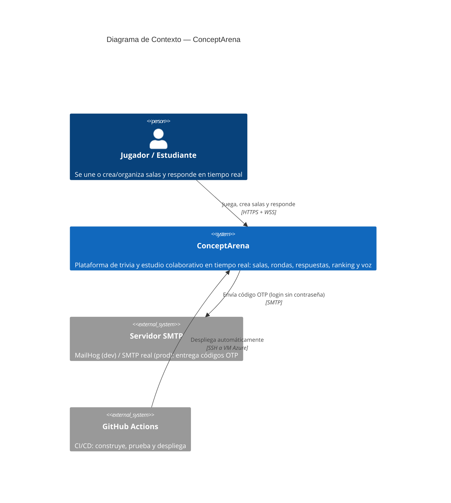
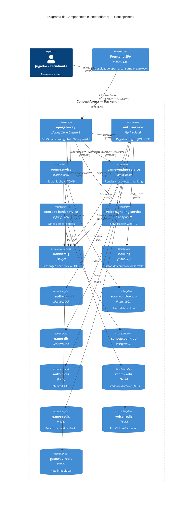
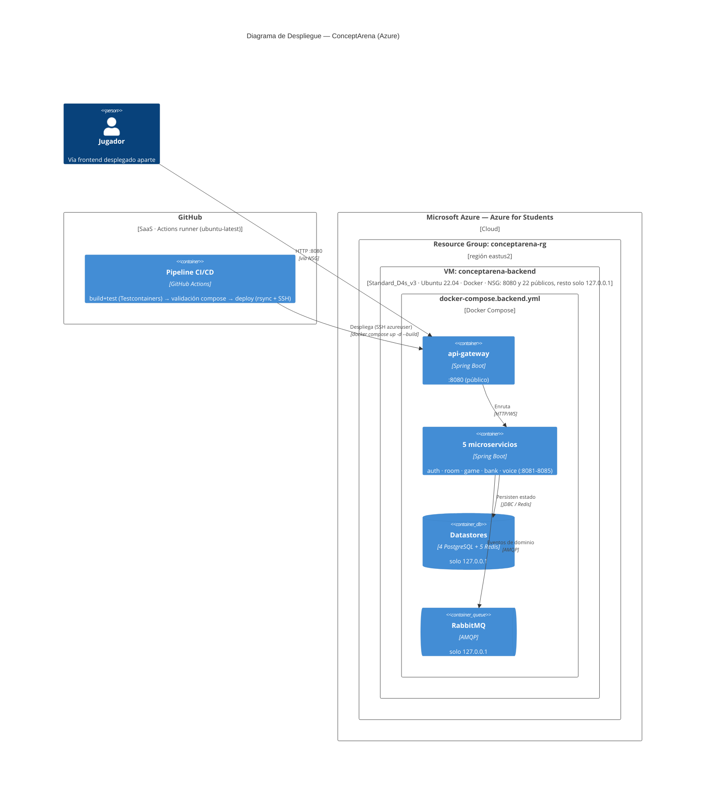
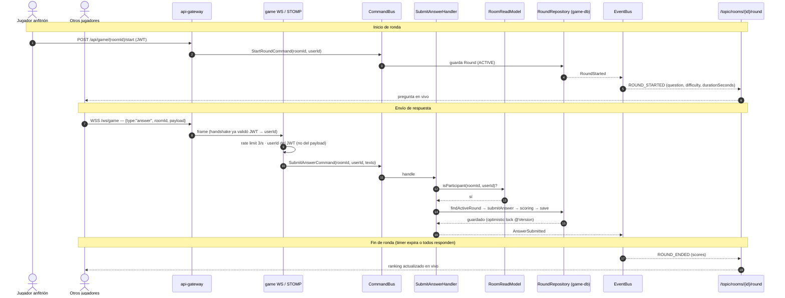
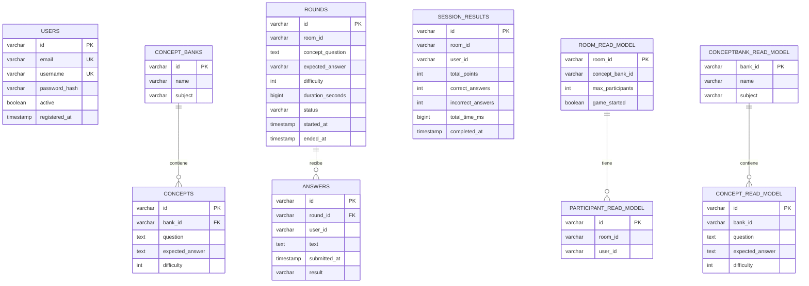

# Diagramas — ConceptArena

Diagramas de arquitectura en **Mermaid**, generados a partir del código real del repositorio y
siguiendo notación estándar: **C4** para contexto/componentes/despliegue y **UML** para secuencia y
entidad-relación. GitHub, VS Code y la mayoría de editores renderizan los bloques ` ```mermaid `
directamente. Para editarlos online: <https://mermaid.live>.

Contenido (únicamente estos 5):

1. [Contexto](#1-contexto) — C4 Nivel 1: usuarios y sistemas externos.
2. [Componentes](#2-componentes) — C4 Nivel 2: contenedores (microservicios + infraestructura).
3. [Despliegue](#3-despliegue) — C4 Deployment: infraestructura física real en Azure + CI/CD.
4. [Secuencia (tiempo real)](#4-secuencia-tiempo-real) — UML: flujo realtime de ronda/respuesta (STOMP).
5. [Entidad-Relación](#5-entidad-relación) — UML/ER: modelo de datos de cada base (una por servicio).

> **Actores:** el único usuario del sistema es el **Jugador/Estudiante**; crear y organizar una sala
> es un rol del propio jugador (no un actor aparte). Los desarrolladores **no** son actores del
> sistema: el despliegue lo realiza GitHub Actions (sistema externo), no una persona.

> Los diagramas reflejan `main` al momento de generarlos. Si el código cambia (nueva clase, campo o
> ruta relevante), actualiza el bloque Mermaid correspondiente a mano.

---

## 1. Contexto

C4 Nivel 1: quién usa ConceptArena y con qué sistemas externos habla.



---

## 2. Componentes

C4 Nivel 2 (contenedores): el api-gateway, los 5 microservicios de dominio y la infraestructura.
Cada servicio es dueño exclusivo de sus almacenes; la comunicación asíncrona pasa por RabbitMQ.



**Nota (patrón Outbox):** en los 4 servicios con BD, escribir estado y registrar el evento es
atómico (misma transacción); un publicador programado drena la tabla `outbox_event` hacia RabbitMQ.

---

## 3. Despliegue

C4 Deployment: infraestructura física **real** desplegada hoy — 1 VM en Azure que corre
`docker-compose.backend.yml`, más el pipeline de GitHub Actions que la actualiza en cada push a `main`.



**Nota:** esta variante NO incluye frontend ni el stack de observabilidad
(Prometheus/Grafana/Loki/Zipkin viven en `docker-compose.yml`, no desplegado en la VM). El
`JWT_SECRET` vive en `~/conceptarena/.env` de la VM y se excluye del rsync.

---

## 4. Secuencia (tiempo real)

Diagrama de secuencia UML del componente central: iniciar una ronda, enviar respuestas por
WebSocket y difundir el resultado a todos los jugadores suscritos vía STOMP
(`/topic/rooms/{roomId}/round`). El **anfitrión es un jugador** que creó la sala.



**Notas de fidelidad:**
- El `userId` siempre proviene del JWT (handshake WS o principal REST), nunca del cuerpo/payload
  del cliente — no se puede suplantar a otro usuario.
- El mismo `AnswerRateLimiter` (3/seg) aplica en la ruta WS y en `POST /api/game/{roomId}/answer`.
- Un cliente que se conecta a mitad de ronda no recibe el `ROUND_STARTED` pasado (pub/sub sin
  replay); usa el fallback REST `GET /api/game/{roomId}/current-round`.

---

## 5. Entidad-Relación

Diagrama ER (UML/crow's foot). Cada microservicio con BD tiene su **propia** base Postgres (no hay
claves foráneas entre bases; los `room_id` / `user_id` / `bank_id` cruzados son referencias
lógicas). Los read-models de game-engine son proyecciones locales, pobladas consumiendo eventos de
RabbitMQ (ADR-004).



**Nota:** `room-service` no tiene tablas de dominio relacionales — su estado (`Room` /
`Participant`) vive en Redis (AOF) y solo persiste una tabla `outbox_event` en `room-outbox-db`.
Los 4 servicios con BD comparten además una tabla `outbox_event` (id, tipo, payload,
correlation_id, estado) omitida arriba por brevedad.
